# 💻 Cómo ejecutar.

> Nota: Este API dependen del API de [días festivos](https://github.com/mkrimaro13/DiasFestivos-API-ExpressJS/tree/docker), puesto que también permite devolver los días festivos, y para realizar el cálculo del calendario depende de estos mismos días.

## ⌨️ Comandos.

### 🔗 Red de contenedores.

Lo primero es que se debe crear una red de datos interna para que los contenedores se puedan comunicar internamente; esto se hace con el comando.

```bash
docker network create <NombreRed>
```

Un ejemplo sería:

```bash
docker network create redfestivoscalendario
```

Y el resultado será un serial o identificador:

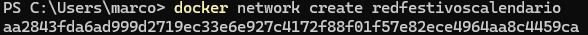

### 🪞 Imagenes necesarias.

- **Postgres**: La base de datos requiere PostgreSQL, para esto comando:

  ```bash
  docker pull postgres
  ```

  Más información sobre la imagen de mongo se puede consultar en el sitio [oficial de docker](https://hub.docker.com/_/postgres/).

  En este caso, también será necesario un script `dockerfile` puesto que es necesario un script DDL para crear la base de datos y un script DML para poblar una de las tablas de la base de datos.

  No se entrará en muchos detalles en esta definición ya que en el archivo se encuentran algunos comentarios útiles.
  Y para ejecutar el archivo y crear la imagen se ejecuta el comando:

  ```bash
  docker build . -t <NombreImagen>
  ```

  ```bash
  docker build . -t bdcalendario
  ```

  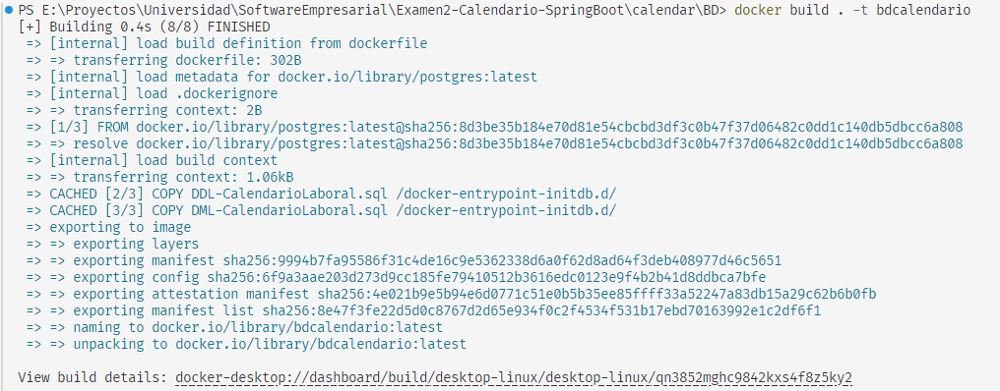

  En este caso se ven dos pasos adicionales donde se copian los scripts para la creación y los registros de la base de datos.

- **Imagen del código**: Para crear la imagen del API se debe crear el archivo [dockerfile](dockerfile) que contendrá las instrucciones para crear la imagen.

  A diferencia del API de `ExpressJS` donde directamente se envía todo el código, para Spring boot (y en general Java) solamente se copia el compilado (El archivo `*.jar`).

  No se entrará en muchos detalles en esta definición ya que en el archivo se encuentran algunos comentarios útiles.
  Y para ejecutar el archivo y crear la imagen se ejecuta el comando:

  ```bash
  docker build . -t <NombreImagen>
  ```

  ```bash
  docker build . -t apicalendario
  ```

  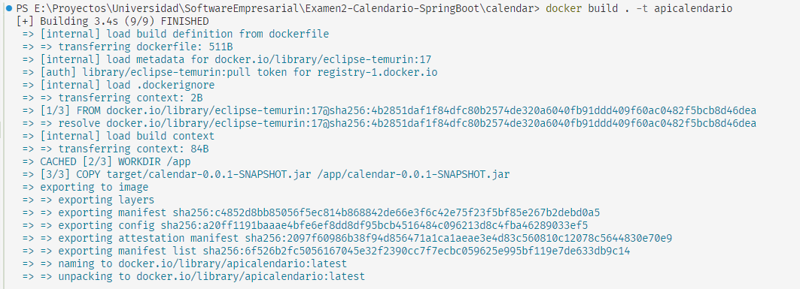

  > Por cada cambio que se realice en el código se debe crear una nueva imagen del código.

### 🐳 Creación de contenedores.

- **Base de datos Postgres**:Luego de tener la imagen creada se debe crear el contenedor de postgres.

  ```bash
  docker run --network <NombreRed> --name <NombreContenedor> -e POSTGRES_PASSWORD=<contraseña> -p <PuertoExterno>:<PuertoInterno> -d <imagen>:<Versión>
  ```

  ```bash
  docker run --network redfestivoscalendario --name bdcalendario -e POSTGRES_PASSWORD=a1234 -p 5433:5432 -d bdcalendario
  ```

  Y el resultado será nuevamente un identificador o serial:

  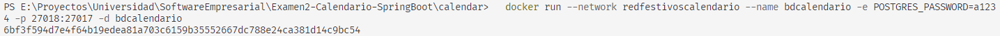

  Se puede ingresar al contenedor (útil para realizar pruebas) y revisar si Postgres fue instalado y si se crearon las tablas y registros que se indicaron en los scripts `SQL`:

  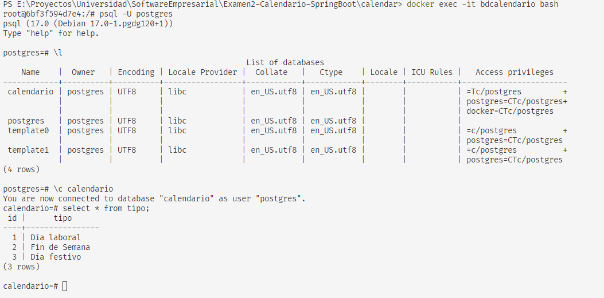

- **Contenerización del API**: Al igual que para la base de datos se ejecuta el comando `docker run`:

  ```bash
   docker run --network redfestivoscalendario --name apicalendario -p 3001:3030  -d apicalendario
  ```

  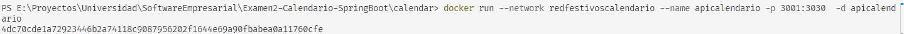

### 🚠 Probar el API.

Para verificar si los contenedores están en ejecución se ejecuta el comando

```bash
docker container list
```

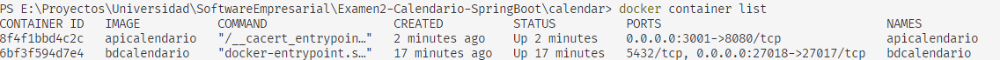

En este caso se ve que están activos los contenedores `bdcalendario` y `apicalendario`, pero como se mencionó también se requiere activar los contenedores de `festivos`:

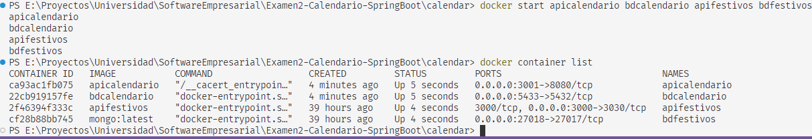

El API se puede probar desde la terminal con la función `cURL` o desde interfaces gráficas como Posmtna o Insomnia.

Se debe tener en cuenta el puerto para probar el API, en este caso será el `3001` ya que fue el puerto que se dejó expuesto para consumir desde _fuera_ de la red de contenedores.

La primera prueba será consumiendo la otra API contenerizada:

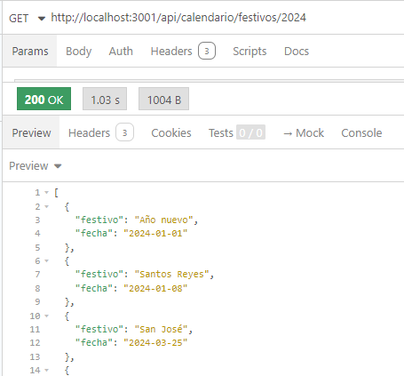

El segundo método para crear el calendario:

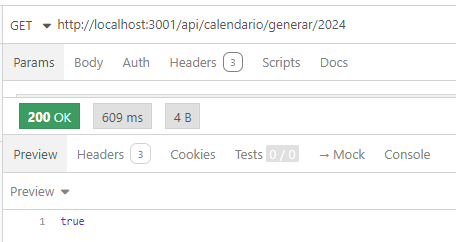

Y finalmente el tercer método para listar el calendario de un año:

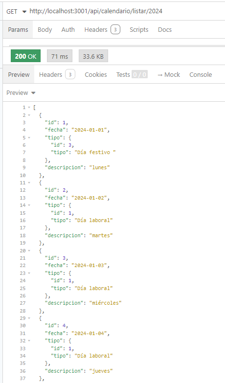

### 📝 Notas adicionales.

**Concatenar comandos**: En caso de alguna falla o cambios en el código, para no tener que ejecutar los comandos uno a uno se pueden concatenar usando `;`

```bash
  docker container stop bdcalendario apicalendario ; docker rm bdcalendario apicalendario ; docker rmi bdcalendario apicalendario ; cd BD ; docker build . -t bdcalendario ; cd .. ; docker build . -t apicalendario ; docker run --network redfestivoscalendario --name bdcalendario -e POSTGRES_PASSWORD=a1234 -p 5433:5432 -d bdcalendario ; docker container run --network redfestivoscalendario --name apicalendario -p 3001:3030 -d apicalendario
```

En este ejemplo se detienen los contenedores de `apifestivos` y `bdfestivos`, se eliminan los contenedores con el comando `rm`, luego se eliminan las imagenes con `rmi`, y se repite el proceso de creación de las imagenes y los contenedores.
